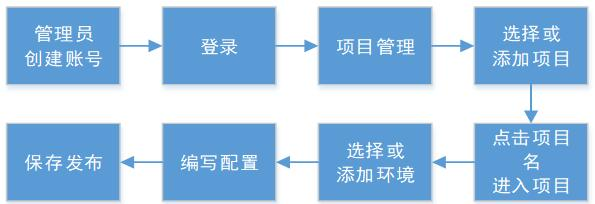
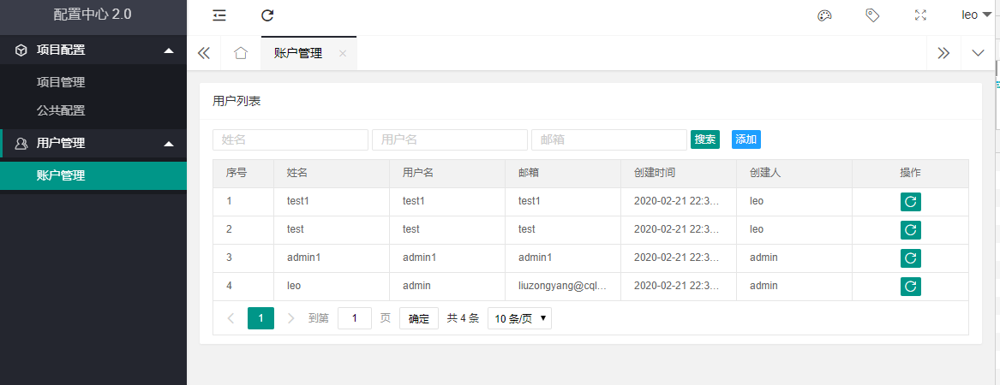
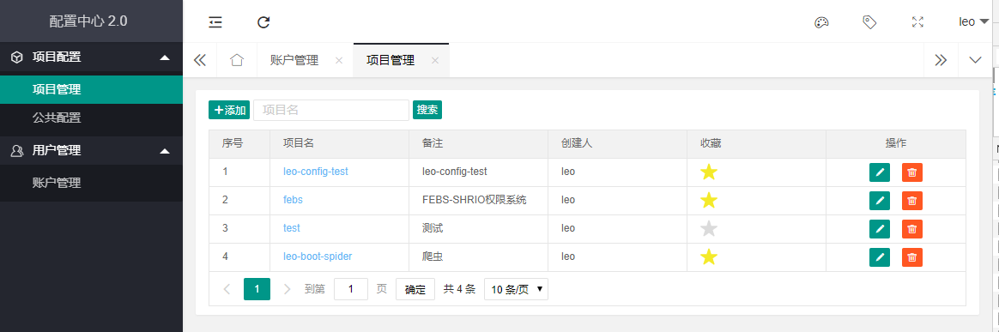
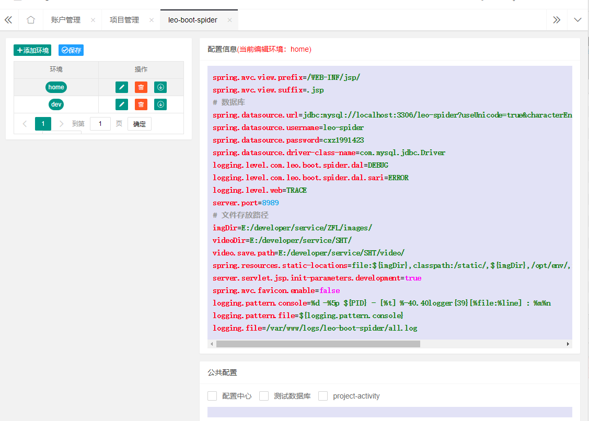
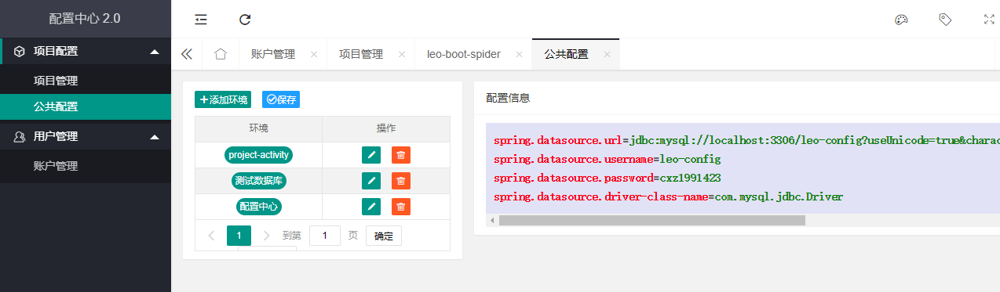
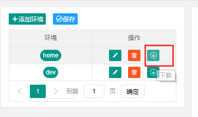
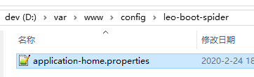

# 配置中心2.0
## 1.序言
在微服务架构体系中配置中心是比较重要的组件之一，Spring Cloud官方自身提供了Spring Cloud Config分布式配置中心，由它来提供集中化的外部配置支持，它分为客户端和服务端两个部分。其中服务端称作配置中心，是一个独立的微服务应用。
我们的配置中心是参照apollo编写的简单轻量版配置管理。可实现所有项目，所有环境配置远程调控，实时发布，高可用等。
第一版的配置中心仅支持`properties`格式配置文件编写
项目git地址：[http://222.178.212.166:10080/server/framework/cqliving-boot-config.git](http://222.178.212.166:10080/server/framework/cqliving-boot-config.git)
## 2.环境

| **名字**           | **版本** |
| ------------------------ | -------------- |
| JDK                      | 1.8            |
| mysql驱动                | 5.1.47         |
| 内置tomcat               | 9.0.31         |
| cqliving-framework-cloud | 1.0.3-SNAPSHOT |
| spring-boot              | 2.2.1.RELEASE  |
| spring-cloud             | Hoxton.SR1     |

注：springboot与cloud版本兼容参照: [https://start.spring.io/actuator/info](https://start.spring.io/actuator/info)


## 3.配置管理
下面是配置管理操作流程



### 3.1管理员创建账号
只有管理员才有权限创建账号或重置密码



### 3.2项目管理
项目管理可以收藏，收藏了的项目可以在首页看到，项目名不能重复



### 3.3环境管理
环境是针对项目的，每个项目有不同的环境，环境名不重复，虽然理论上可以支持开发、测试、预发布、生产环境等所有环境，但是为了运维考虑，生产环境最好与测试开发环境分开部署。
环境名只能是数字，下划线，中划线，字母组合



### 3.4公共配置管理
比如有一些项目通用的配置，可以放在公共配置管理内，项目内就可以不用重复编写了，只需在3.3公共配置栏勾选即可，这里公共配置最好用环境名前缀区分，如`dev_测试数据库`



## 4.服务端接入
服务开发需要引用微服务框架包:`cqliving-framework-cloud-config`

```xml
<parent>
    <groupId>org.cqlivingframework.cloud</groupId>
    <artifactId>cqliving-framework-cloud-parent</artifactId>
    <version>1.0.3-SNAPSHOT</version>
</parent>

<dependency>
    <groupId>org.cqlivingframework.cloud</groupId>
    <artifactId>cqliving-framework-cloud-mybatis</artifactId>
</dependency>
<dependency>
    <groupId>org.cqlivingframework.cloud</groupId>
    <artifactId>cqliving-framework-cloud-config</artifactId>
</dependency>
```

### 4.1修改启动类

```java
@CqlivingBootApplication(appName = "cqliving-boot-test", configEnable = true, httpPort = 8081, profileActive = "test")
```
各默认值参照注解内详情.

```java
public @interface CqlivingBootApplication {

    /** 应用名 */
    String appName();
    
    /** 系统http服务端口 */
    int httpPort() default 8080;
    
    /** 是否启动配置中心，默认否 */
    boolean configEnable() default false;
    
    /** 配置中心地址，默认:http://localhost:8970 */
    String configUrls() default "http://localhost:8970";
    
    /** <p>运行环境，默认:dev */
    String profileActive() default "dev";
}
```

配置中心地址config.urls由于是项目启动前就需要配置，所以需要由jvm变量指定，开发阶段无需指定，框架默认是dev,其余环境需要用jvm变量指定,在-jar参数前指定，
格式:-Dconfig.urls=ip1:port1,ip2:port2


### 4.2启动预览

```
18:44:18.486 [Main] INFO org.cqliving.framework.cloud.config.CqlivingBootApplicationRunListener - 当前配置中心地址:http://localhost:8970
18:44:18.491 [Main] INFO org.cqliving.framework.cloud.config.CqlivingBootApplicationRunListener - 您可以通过VM参数-Dconfig.urls=ip1:port1,ip2:port2来指定配置中心地址
18:44:18.491 [Main] DEBUG org.cqliving.framework.cloud.config.CqlivingBootApplicationRunListener - 当前设置运行环境:home
18:44:18.493 [Main] INFO org.cqliving.framework.cloud.config.holder.ConfigStarter - 调用配置中心: urls=http://localhost:8970, appName=leo-boot-spider, env=home
18:44:18.574 [Main] DEBUG cn.hutool.log.LogFactory - Use [Slf4j] Logger As Default.
18:44:18.586 [Main] DEBUG cn.hutool.http.cookie.GlobalCookieManager - Add Cookie from local store: []
18:44:18.609 [Main] DEBUG cn.hutool.http.cookie.GlobalCookieManager - Store Cookie: JSESSIONID=2F1F495D36D2A1EE373A2490E1B0D829; Path=/; HttpOnly
18:44:18.630 [Main] INFO org.cqliving.framework.cloud.config.holder.ConfigContextHolder - 加载配置[19]条
18:44:18.631 [Main] DEBUG org.cqliving.framework.cloud.config.holder.ConfigContextHolder - imgDir=E:/developer/service/ZFL/images/
18:44:18.631 [Main] DEBUG org.cqliving.framework.cloud.config.holder.ConfigContextHolder - logging.file=/var/www/logs/leo-boot-spider/all.log
18:44:18.631 [Main] DEBUG org.cqliving.framework.cloud.config.holder.ConfigContextHolder - logging.level.com.leo.boot.spider.dal=DEBUG
18:44:18.631 [Main] DEBUG org.cqliving.framework.cloud.config.holder.ConfigContextHolder - logging.level.com.leo.boot.spider.dal.sari=ERROR
18:44:18.631 [Main] DEBUG org.cqliving.framework.cloud.config.holder.ConfigContextHolder - logging.level.web=TRACE
18:44:18.631 [Main] DEBUG org.cqliving.framework.cloud.config.holder.ConfigContextHolder - logging.pattern.console=%d -%5p ${PID} - [%t] %-40.40logger{39}[%file:%line] : %m%n
18:44:18.631 [Main] DEBUG org.cqliving.framework.cloud.config.holder.ConfigContextHolder - logging.pattern.file=${logging.pattern.console}
18:44:18.631 [Main] DEBUG org.cqliving.framework.cloud.config.holder.ConfigContextHolder - server.port=8989
18:44:18.631 [Main] DEBUG org.cqliving.framework.cloud.config.holder.ConfigContextHolder - server.servlet.jsp.init-parameters.development=true
```
### 4.3高可用
项目配置可以导出到各项目下，运行jar包时可以指定jar包外部配置文件，或者替换配置中心缓存路径`/var/www/config/${appName}/application-${envName}.properties`



项目在拉取到配置时会自动缓存一份到本地，当配置中心不可用时，会使用本地缓存，不会影响项目启动和运行。当配置中心正常访问时，再次获取的配置会覆盖本地缓存配置


### 4.4配置优先级
 以下是springboot项目配置文件优先级由高到低：参照：[配置优先级](https://www.jianshu.com/p/3fc6a78eed31)
 
```
 1.Devtools全局配置
 2.@TestPropertySource注解
 3.@SpringBootTest的properties属性
 4.命令行参数
 5.SPRING_APPLICATION_JSON
 6.ServletConfig、ServletContext
 7.JNDI
 8.Java System properties (System.getProperties())
 9.系统环境变量
 10.随机数配置 my.secret=${random.value}
 11.配置中心的配置文件（此处为配置中心新增）
 12.自定义配置文件 spring.profiles.active
 13.application.properties
 14.@PropertySource
 15.Spring Boot内部默认的配置参数
``` 
